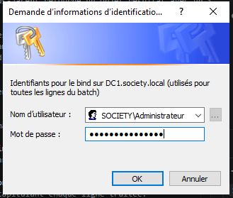
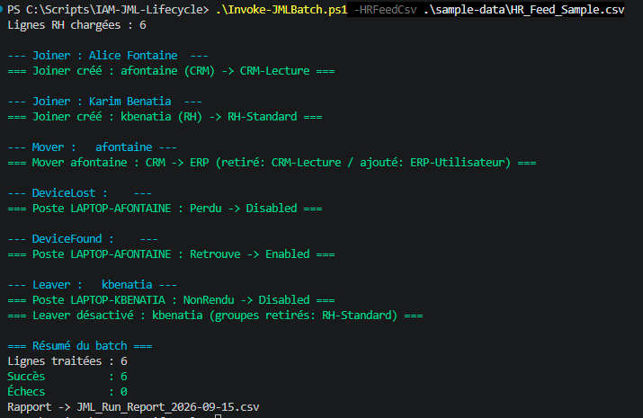
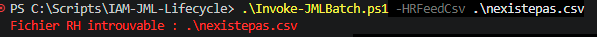
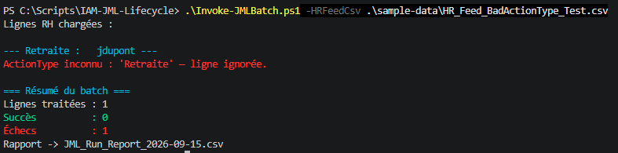
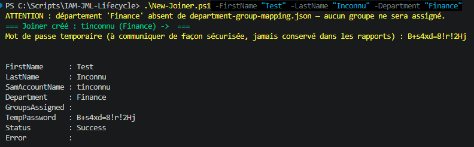
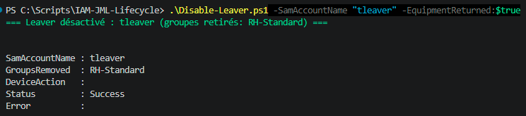
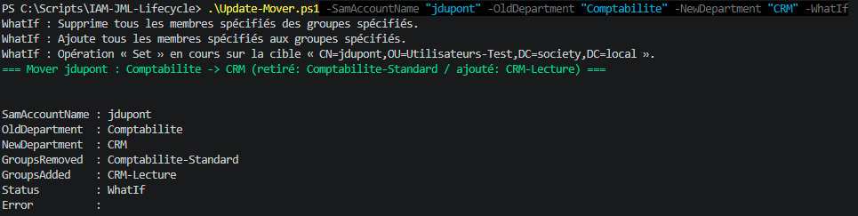
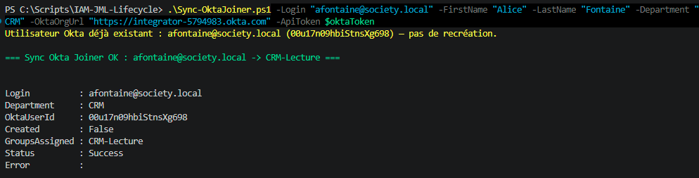
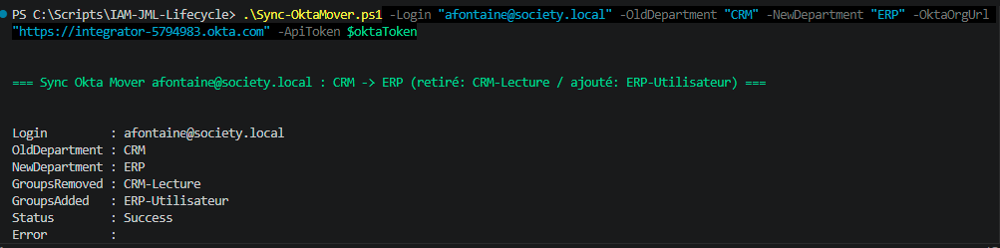
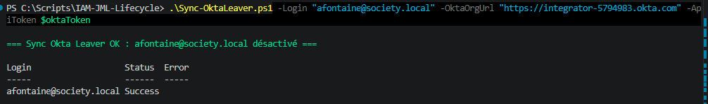

# 🔄 IAM JML Lifecycle


Automatisation Joiner/Mover/Leaver (JML) sur Active Directory — la brique qui referme le cycle
de vie identité que [LDAP-App-Role-Audit](https://github.com/Anne-LaureS/LDAP-App-Role-Audit)
et [IAM-Access-Recertification](https://github.com/Anne-LaureS/IAM-Access-Recertification)
laissent ouverte : ces deux repos détectent et décident quoi révoquer, celui-ci exécute
réellement la création, la modification et la désactivation des comptes dans l'annuaire.

Testé contre le même lab Active Directory (Windows Server 2022, `DC1.society.local`) que
LDAP-App-Role-Audit.

Gère l'appartenance aux groupes standard d'un compte sur la durée de son cycle de vie ; pour une
appartenance **temporaire** à un groupe à privilège (accès juste-à-temps), voir
[IAM-JIT-PAM](https://github.com/Anne-LaureS/IAM-JIT-PAM).

## ⚙️ Les scripts

| # | Script | Rôle | Sortie |
|---|---|---|---|
| — | [`New-Joiner.ps1`](New-Joiner.ps1) | Crée un compte et lui attribue son accès de base selon son département | Objet résultat (SamAccountName, mot de passe temporaire, groupes assignés) |
| — | [`Update-Mover.ps1`](Update-Mover.ps1) | Retire les groupes de l'ancien département, ajoute ceux du nouveau | Objet résultat (groupes retirés/ajoutés) |
| — | [`Disable-Leaver.ps1`](Disable-Leaver.ps1) | Retire tous les accès, désactive le compte, le déplace dans OU=Leavers | Objet résultat (groupes retirés, action matériel éventuelle) |
| — | [`Set-DeviceStatus.ps1`](Set-DeviceStatus.ps1) | Active/désactive un objet ordinateur AD (perdu/retrouvé/non rendu) | Objet résultat (action, statut) |
| — | [`Invoke-JMLBatch.ps1`](Invoke-JMLBatch.ps1) | Orchestrateur : lit un CSV RH et dispatche chaque ligne vers le script adapté | `JML_Run_Report_AAAA-MM-JJ.csv` |

Les 4 premiers scripts sont indépendants et directement utilisables un par un (paramètres
explicites, pas besoin de passer par l'orchestrateur pour traiter un seul cas). L'orchestrateur
sert à traiter un lot — le cas réel d'un export RH périodique.

## ⚙️ Pipeline

```
Export RH (CSV) --> Invoke-JMLBatch.ps1 --dispatch par ActionType-->
    Joiner      --> New-Joiner.ps1       --> compte créé + accès de base
    Mover       --> Update-Mover.ps1     --> accès mis à jour
    Leaver      --> Disable-Leaver.ps1   --> compte désactivé, accès retiré
                        │
                        └──► si matériel non rendu ──► Set-DeviceStatus.ps1 (NonRendu)
    DeviceLost  --> Set-DeviceStatus.ps1 (Perdu)
    DeviceFound --> Set-DeviceStatus.ps1 (Retrouve)
                                    │
                                    ▼
                        JML_Run_Report_AAAA-MM-JJ.csv
```

## ▶️ Utilisation

Les commandes ci-dessous s'exécutent depuis la racine du repo et sont directement à
copier-coller (adapter les valeurs FirstName/LastName/Department à votre cas).

### Un cas isolé

```powershell
.\New-Joiner.ps1 -FirstName "Alice" -LastName "Fontaine" -Department "CRM"
```

```powershell
.\Update-Mover.ps1 -SamAccountName "afontaine" -OldDepartment "CRM" -NewDepartment "ERP"
```

```powershell
.\Disable-Leaver.ps1 -SamAccountName "kbenatia" -AssetTag "LAPTOP-KBENATIA" -EquipmentReturned:$false
```

```powershell
.\Set-DeviceStatus.ps1 -AssetTag "LAPTOP-AFONTAINE" -Reason Perdu
```

Chaque script demande les identifiants du bind AD interactivement (`Get-Credential`) s'ils ne
sont pas fournis via `-Credential`, et supporte `-WhatIf` pour simuler sans rien écrire dans
l'annuaire.

### Un lot (export RH)

```powershell
.\Invoke-JMLBatch.ps1 -HRFeedCsv .\sample-data\HR_Feed_Sample.csv -OutputReportCsv .\JML_Run_Report.csv
```

Demande les identifiants **une seule fois** pour tout le lot, puis dispatche chaque ligne du
CSV vers le script correspondant selon la colonne `ActionType` (`Joiner`, `Mover`, `Leaver`,
`DeviceLost`, `DeviceFound`) — voir [`sample-data/HR_Feed_Sample.csv`](sample-data/HR_Feed_Sample.csv)
pour le schéma complet des colonnes. Une ligne en échec n'interrompt pas le traitement des
suivantes.

Par défaut, `-OutputReportCsv` est nommé avec la date du jour
(`JML_Run_Report_AAAA-MM-JJ.csv`) — utile en usage réel (une trace par exécution), mais la
commande ci-dessus fixe volontairement un nom constant pour que l'exemple reste copiable sans
changer de date.

## 📊 Exemple de bout en bout

Avec les données d'exemple ([`sample-data/HR_Feed_Sample.csv`](sample-data/HR_Feed_Sample.csv)
— 2 Joiners, 1 Mover, 1 Leaver avec matériel non rendu, 1 cycle perdu/retrouvé), résultat réel
obtenu contre le lab AD (`DC1.society.local`) en exécutant la commande ci-dessus :

| Ligne | Résultat |
|---|---|
| Joiner Alice Fontaine (CRM) | Compte `afontaine` créé, groupe `CRM-Lecture` assigné |
| Joiner Karim Benatia (RH) | Compte `kbenatia` créé, groupe `RH-Standard` assigné |
| Mover `afontaine` (CRM → ERP) | `CRM-Lecture` retiré, `ERP-Utilisateur` ajouté |
| DeviceLost `LAPTOP-AFONTAINE` | Objet ordinateur désactivé |
| DeviceFound `LAPTOP-AFONTAINE` | Objet ordinateur réactivé |
| Leaver `kbenatia` (matériel non rendu) | Groupe `RH-Standard` retiré, compte désactivé et déplacé vers `OU=Leavers`, `LAPTOP-KBENATIA` désactivé |

**6 lignes traitées, 6 succès, 0 échec** — [`JML_Run_Report.csv`](JML_Run_Report.csv) (mot de
passe temporaire retiré du fichier avant publication).





### Mapping département → accès

[`department-group-mapping.json`](department-group-mapping.json) associe chaque département à
son (ses) groupe(s) AD de base — repris tels quels des groupes déjà audités par
LDAP-App-Role-Audit et recertifiés par IAM-Access-Recertification, pour que le compte créé ici
ait exactement l'accès que les deux autres repos savent auditer et recertifier ensuite.
Volontairement limité aux rôles "Standard"/"Lecture" — l'élévation vers un rôle Admin se
demande séparément, le birthright reste du moindre privilège.

## 🧪 Robustesse — cas limites testés

Au-delà du scénario nominal ci-dessus, ces comportements sont vérifiés contre le lab réel :

**CSV RH introuvable** — message d'erreur clair, arrêt immédiat, aucun prompt d'identifiants inutile :



**`ActionType` inconnu dans une ligne** — signalée en échec sans interrompre le reste du batch
(voir [`sample-data/HR_Feed_BadActionType_Test.csv`](sample-data/HR_Feed_BadActionType_Test.csv)) :



**Département absent de `department-group-mapping.json`** — warning explicite, compte créé
quand même, aucun groupe assigné (pas d'échec silencieux) :



**Leaver sans matériel à traiter** (`-AssetTag` omis) — désactivation/déplacement normaux,
aucune tentative sur un objet ordinateur :



**`-WhatIf` isolé sur un compte réel existant** — toutes les actions AD affichées en
simulation, rien modifié pour de vrai :



## 🔐 Sécurité & précautions

- Comptes créés dans `OU=Utilisateurs,DC=society,DC=local` — une OU dédiée, vide, distincte à
  la fois de `CN=Users` (conteneur intégré : Administrator, Domain Admins, et autres objets
  système par défaut) et de `OU=Utilisateurs-Test` qui contient les 21 comptes de démo
  LDAP-App-Role-Audit (on ne veut mélanger ni l'un ni l'autre).
- Écritures via le module `ActiveDirectory` (`New-ADUser`, `Add/Remove-ADPrincipalGroupMembership`,
  `Disable/Enable-ADAccount`...) plutôt que du LDAP brut comme LDAP-App-Role-Audit — ce dernier
  reste agnostique du schéma pour un usage en lecture seule, mais pour des écritures réelles
  (création de compte, pose de mot de passe) le module AD est l'outil réellement utilisé en
  entreprise pour ce cas, plus sûr qu'un `ModifyRequest` LDAP brut avec mot de passe encodé
  manuellement en UTF-16LE.
- Mot de passe temporaire généré aléatoirement (respect de la complexité AD par défaut),
  `ChangePasswordAtLogon` forcé — jamais de mot de passe fixe/prévisible. Affiché uniquement
  dans la sortie console de `New-Joiner.ps1` (à communiquer directement à la personne
  concernée) : **jamais écrit dans un fichier persistant** — exclu du rapport de lot
  `JML_Run_Report.csv`, qui peut être relu par d'autres que la personne qui l'a exécuté.
- `Disable-Leaver.ps1` désactive le compte utilisateur ET, si un poste non rendu est déclaré,
  désactive aussi l'objet ordinateur correspondant (`Set-DeviceStatus.ps1 -Reason NonRendu`) —
  un compte désactivé ne bloque pas un poste qui garde une session locale en cache.
- Chaque script retourne un objet résultat structuré et n'interrompt jamais un traitement en
  lot sur une erreur individuelle (try/catch systématique).
- `-WhatIf` supporté de bout en bout (scripts unitaires et orchestrateur) pour dry-run avant
  toute écriture réelle contre l'annuaire.
- **Fichiers `.ps1`/`.json`/`.csv` en UTF-8 avec BOM** dès leur création, comme le reste du
  portfolio — Windows PowerShell 5.1 lit mal les accents sans ce marqueur en tête de fichier.

## 🌐 V2 — synchronisation Okta

**Les 3 scripts sont testés avec succès contre le tenant réel** (`Sync-OktaJoiner.ps1` —
création, idempotence sur relance, résolution et assignation de groupe par nom ;
`Sync-OktaMover.ps1` — diff de groupes CRM → ERP appliqué correctement ; `Sync-OktaLeaver.ps1` —
désactivation confirmée). AD reste la source de vérité ; l'idée est de répercuter chaque
événement JML vers
[Okta-SSO-Debug-Lab](https://github.com/Anne-LaureS/Okta-SSO-Debug-Lab) (même tenant, déjà
configuré) pour que le provisioning AD et l'authentification fédérée restent cohérents. Vérifié
au préalable : l'API Users Okta (création, désactivation, groupes) fait partie de la Lifecycle
Management incluse dans le plan Integrator Free utilisé — pas une fonctionnalité entreprise
verrouillée, contrairement à l'authentification déléguée AD envisagée puis écartée pour
AD-LDAP-Bind-Debug-Lab.

| Événement | Action AD (existante) | Script Okta (v2) | Endpoint Okta | Note |
|---|---|---|---|---|
| Joiner | `New-Joiner.ps1` | [`Sync-OktaJoiner.ps1`](Sync-OktaJoiner.ps1) | `POST /api/v1/users?activate=true` puis `PUT /api/v1/groups/{groupId}/users/{userId}` | Le login Okta doit correspondre à l'UPN AD (`sam@society.local`) pour corréler les deux comptes |
| Mover | `Update-Mover.ps1` | [`Sync-OktaMover.ps1`](Sync-OktaMover.ps1) | `DELETE /api/v1/groups/{old}/users/{id}` puis `PUT /api/v1/groups/{new}/users/{id}` | Réutilise `department-group-mapping.json` : les groupes Okta doivent porter exactement les mêmes noms que les groupes AD (résolution par nom via l'API, pas de fichier de correspondance séparé) |
| Leaver | `Disable-Leaver.ps1` | [`Sync-OktaLeaver.ps1`](Sync-OktaLeaver.ps1) | `POST /api/v1/users/{id}/lifecycle/deactivate` | Équivalent fonctionnel de `Disable-ADAccount` — récupérable via réactivation, pas une suppression |
| DeviceLost / DeviceFound | `Set-DeviceStatus.ps1` | — | — | Hors périmètre : Okta ne gère pas les objets ordinateur AD |

Chaque script prend `-OktaOrgUrl` (URL du tenant, ex: `https://dev-12345.okta.com`) et
`-ApiToken` (jeton API Okta en SecureString, généré dans Security > API > Tokens) — jamais en
argument de ligne de commande en clair, même discipline que les mots de passe AD du reste du
repo.







**Note pratique validée** : les groupes Okta ne se créent pas automatiquement comme côté AD —
il faut créer manuellement chaque groupe (`Directory > Groups` dans la console Okta) avec
exactement le même nom que son équivalent AD avant de synchroniser un département donné.
| DeviceLost / DeviceFound | `Set-DeviceStatus.ps1` : active/désactive l'objet ordinateur AD | Hors périmètre | — | Okta ne gère pas les objets ordinateur AD ; la Devices API Okta couvre les appareils enrôlés MDM, un concept différent |
